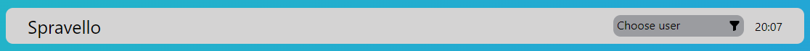
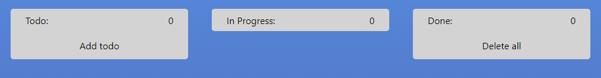
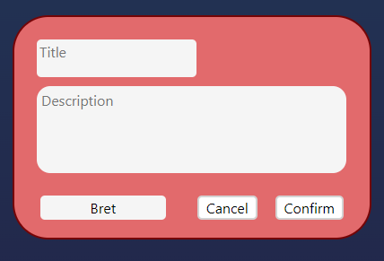
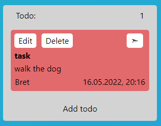
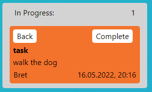
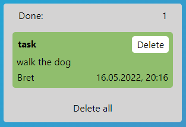

<div id="top"></div>

<h1 align="center">SPRAVELLO</h1>

<p align="center"><a href=""></a></p>

<ol>
  <li>
    <a href="#About-the-project">About the project</a>
  </li>
  <li>
    <a href="#Installing-and-running-the-project"
      >Installing and running the project</a
    >
  </li>
  <li>
    <a href="#Project-elements">Project-elements</a>
    <ul>
      <li><a href="#Header">Header</a></li>
      <li>
        <a href="#Todo-cards">Todo's Lists</a>
        <ul>
          <li><a href="#Todo">Todo</a></li>
          <li><a href="#In-Progress">In Progress</a></li>
          <li><a href="#Done">Done</a></li>
        </ul>
      </li>
    </ul>
  </li>
  <li><a href="#Used-techologies">Used techologies</a></li>
  <li><a href="#Our-team">Our Team</a></li>
  <li><a href="#Acknowledgment">Acknowledgment</a></li>
</ol>

### [Watch demo](https://evgenywas.github.io/spravello/)

## About the project 

The "Spravello" project is a simplified version of the cloud-based software which manages small groups' projects "Trello".

<p align="right">(<a href="#top">Back to top</a>)</p>

### Installing and running the project You need to do the following: 

1.  Copy repository
   ```sh
   git clone https://github.com/EvgenyWas/spravello.git
   ```
2.  Install Node modules
   ```sh
   npm install
   ```
3.  Build and run project
   ```sh
   npm run dev
   ```
<p align="right">(<a href="#top">Back to top</a>)</p>

# Project elements

## Header

[]()

1.  Website logo
2.	You can easily find any user among the tasks using the filter list.
3.	After selecting a user, use the filter button to find the user you want.
4.  The clock always shows the current time so that you can easily keep track of it.


## Todo cards

Next you see three columns for placing your "todo" tasks.

[]()

### Todo

The "todo" column contains all tasks that aren't "In progress" and haven't been completed. There's an "Add todo" button on the card to add a new task. After clicking "Add todo", a modal window opens with a header, main text, a button which, when clicked, selects a specific user to perform the task and an accept button which adds the task to the board, and a cancel button which simply deletes this "Todo".

[]()

*You can use drag&drop to move cards from one list to another, or use the buttons described below.*

When the task is added to the column, there's "Edit" button at the top which allows you to edit the task and "Delete" button which removes the task from the column. There's also a conversion button which, when clicked, moves the task to the "In Progress" column.

[]()

### In Progress

The "In Progress" column contains the tasks that are currently in progress. You can "rewind" the task back to the "Todo" list by pressing the "Back" button and you can also move it to the "Done" column, where the completed tasks are located, by pressing the "Complete" button.

[]()

### Done

The "Done" column contains tasks that have already been completed. At the bottom of the column is the "Delete All" button, which deletes the entire list of tasks entered there, and if you only need to delete one specific task simply click on the "Delete" button on the card itself.

[]()

<p align="right">(<a href="#top">Back to top</a>)</p>

## Used techologies

In our project we used:

- JavaScript
- SCSS
- Parcel-bundler
- JSONPlaceholder API
- component approach

<p align="right">(<a href="#top">Back to top</a>)</p>


## Our Team

- Evgeny - [Evgeny-Vasiukevich](https://github.com/EvgenyWas)
- Andrey - [Andrey-Zhukovets](https://github.com/a-zhukovets)
- Nikita - [Nikita-Lugovskih](https://github.com/nikitalugovskih)
- Evgeny - [Zhenya-Lis](https://github.com/zhenyalis)
- David - [David-Kokojevs](https://github.com/kokoiev34)
- Anastasia - [Anastasia-Shkulkova](https://github.com/AnastasiaShkulkova)

<p align="right">(<a href="#top">Back to top</a>)</p>

# Acknowledgment

Special thanks to our teacher for his super-valuable help in creating this project.

Stas - [Stanislav-Tavyrin](https://github.com/stnslvtvrn)

<p align="right">(<a href="#top">Back to top</a>)</p>
