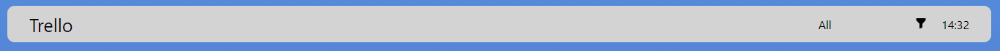
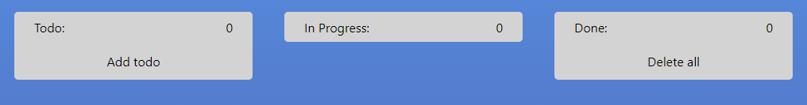
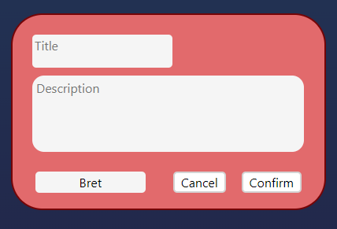

<div id="top"></div>

<h1 align="center">SPRAVELLO</h1>

<p align="center"><a href=""></a></p>

<ol>
  <li>
    <a href="#About-the-project">About the project</a>
  </li>
  <li>
    <a href="#Installing-and-running-the-project"
      >Installing and running the project</a
    >
  </li>
  <li>
    <a href="#Project-elements">Project-elements</a>
    <ul>
      <li><a href="#Header">Header</a></li>
      <li>
        <a href="#Todo-cards">Todo Cards</a>
        <ul>
          <li><a href="#Todo">Todo</a></li>
          <li><a href="#In-Progress">In Progress</a></li>
          <li><a href="#Done">Done</a></li>
        </ul>
      </li>
    </ul>
  </li>
  <li><a href="#Used-techologies">Used techologies</a></li>
  <li><a href="#Our-team">Our Team</a></li>
  <li><a href="#Acknowledgment">Acknowledgment</a></li>
</ol>

## About the project 

The "Spravello" project is a simplified version of the
cloud-based small group project management software "Trello". 

[]()

<p align="right">(<a href="#top">Back to top</a>)</p>

### Installing and running the project You need to do the following: 

1.  Copy repository
   ```sh
   git clone
   ```
2.  Install Node modules
   ```sh
   npm install
   ```
3.  Build and run project
   ```sh
   npm run dev
   ```
<p align="right">(<a href="#top">Back to top</a>)</p>

# Project elements

## Header

[]()

1.  Website logo
2.	You can easily find any user among the tasks using the filter list.
3.	After selecting a user, use the filter button to find the user you want.
4.  The clock will always show you the current time so that you can easily keep track of it.

## Todo cards

Далее вы увидите три колонки для размещения ваших задач "todo".

[]()

### Todo

The "todo" column contains all tasks that are not in progress and have not been completed. There is an "Add todo" button on the card to add a new task. Then a modal window opens with a header, main text, a button which, when clicked, selects a specific user to perform the task and an accept button which will add the task to the board, and a cancel button which will simply delete this "Todo".

[]()

Once a task has been added to the board, there are "Edit" buttons at the top which will allow you to edit your task and "Delete" buttons which will remove the task from the list. There is also a conversion button which, when clicked, will move the task to the "In Progress" list.

[]()

### In Progress

The "In Progress" column contains the tasks that are currently in progress. You can "rewind" the task back to the "Todo" list by pressing the "Back" button and you can also move it to the "Done" column, where the completed tasks are located, by pressing the "Complete" button.

[]()

### Done

The "Done" column contains tasks that have already been completed. At the bottom of the column is the "Delete All" button, which will delete the entire list of tasks entered there, or if you only need to delete one, specific task, simply click on the "Delete" button on the card itself.

[]()

<p align="right">(<a href="#top">Back to top</a>)</p>

## Used techologies

In our project we used:

- scss
- javascript
- parcel-bundler
- JSONPlaceholder API
- component approach

<p align="right">(<a href="#top">Back to top</a>)</p>


## Our Team

- Evgeniy - []()
- Andrey - [Andrey-Zhukovets](https://github.com/a-zhukovets)
- Nikita - [Nikita-Lugovskih](https://github.com/nikitalugovskih)
- Evgeniy - [Zhenya-Lis](https://github.com/zhenyalis)
- David - [David-Kokojev]()
- Anastasia - [Anastasia-Shkulkova](https://github.com/AnastasiaShkulkova)

Project link:

<p align="right">(<a href="#top">Back to top</a>)</p>

# Acknowledgment

Special thanks to our teacher for her super-valuable help in creating this project.

Stas - [Stanislav-Tavyrin](https://github.com/stnslvtvrn)

<p align="right">(<a href="#top">Back to top</a>)</p>
